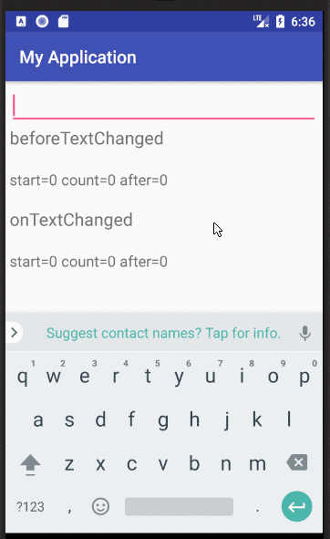

# EditText의 변경을 감지하는 TextWatcher

---

## TextWatcher란?

TextWatcher은 EditText의 값이 변경될 때 호출되는 리스너임  
TextWatcher은 아래의 3가지 메서드로 구성되어 있음

| 태그                                                                    | 설명                                                                      |
| ----------------------------------------------------------------------- | ------------------------------------------------------------------------- |
| void afterTextChanged(Editable s)                                       | 텍스트가 변경된 후 알림<br/>**텍스트 변경 가능!**                         |
| void beforeTextChanged(CharSequence s, int start, int count, int after) | s의 문자가 새 텍스트를 대치되는 것을 알림 (새로 변경한 텍스트의 그 전 값) |
| void onTextChanged(CharSequence s, int start, int before, int count)    | 텍스트를 변경 시 알림 <br/>**텍스트 변경 불가능**                         |

<br/>
아래 이미지를 참고하여 이해해보장



<br/>

## afterTextChanged vs onTextChanged

afterTextChanged와 onTextChanged 메서드는 둘 다 변경된 텍스트를 감지한다는 점에서 동일하다.  
그렇다면, 어떤 메서드를 사용해야 할까?

두 메서드의 차이는 텍스트를 변경할 수 있냐 없냐의 차이에 있다.  
afterTextChanged 메서드에 경우 파라미터가 Editable이라

onTextChanged에서 해당 텍스트를 변경하면 ANR이 발생하는 이유도 다음과 같다!

전화번호를 입력할 때 중간에 -를 추가하는 기능을 개발해야 한다고 가정하자.

## 사용법

```java
editText.addTextChangedListener(object : TextWatcher() {

})
```

---

## References

- https://developer.android.com/reference/android/text/TextWatcher
- https://onlyfor-me-blog.tistory.com/435
- https://stackoverflow.com/questions/476848/android-textwatcher-aftertextchanged-vs-textwatcher-ontextchanged
