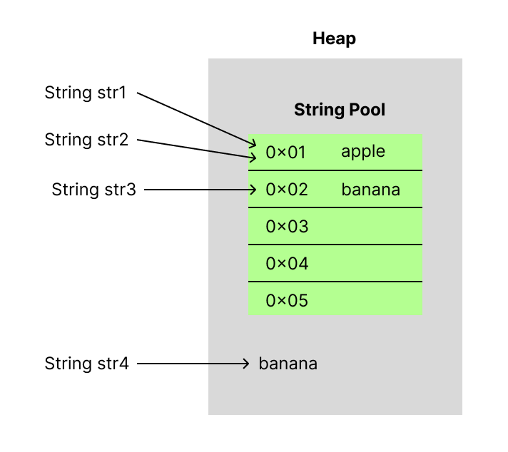
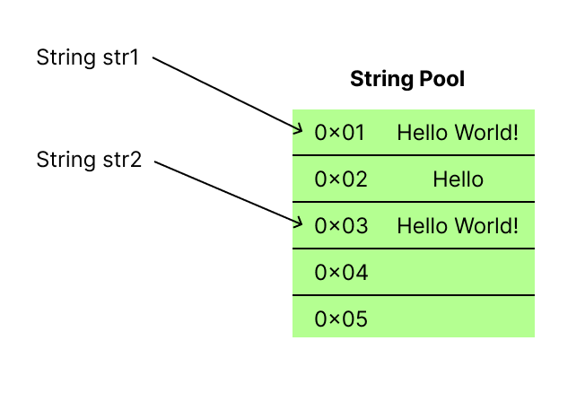

# 문자열 값들이 모여있는 String Pool!

- String Pool
- String 값 비교에 equals를 사용하는 이유
- Immutable String, Mutable StringBuilder/StringBuffer
- StringBuilder와 StringBuffer의 차이점

---

## 왜 String은 new 키워드를 통해 생성하지 않나요?

```java
String name1 = "승연";
String name2 = new String("승연");
```

자바의 모든 참조 자료형을 생성할 때, 반드시 new 키워드를 사용해 생성한다.  
하지만 참조 자료형에 속하는 String은 예외적으로, `new`를 사용하지 않고 주로 `""`(String literal)를 사용해 값을 초기화한다.  

이 이유를 알기 위해서는 먼저 String Pool의 개념을 알아야 한다.

<br/>

### String Pool

<!-- 자바 프로그램을 개발하다보면 항상 String 객체를 많이 사용한당.... -->
> 힙 영역에 위치해, String 값을 재사용하기 위한 메모리 장소!

String 자료형을 초기화 해줄 때 `String literal`를 사용해 초기화해주는 이유도 String Pool에 있다.  
`String literal`를 사용해 생성한 String 객체의 경우, **그 값이 String Pool에 없다면 새로 삽입**되고, **이미 존재하는 값이면 그 값의 주소값을 참조**한다.

아래의 예시를 보면서 이해해보자.

```java
String str1 = "apple";
String str2 = "apple";
String str3 = "banana";
String str4 = new String("banana");
```

<div style="text-align: center;">
    
</div>


처음 `str1`의 apple 값은 기존 String Pool에 없는 값이니 **새로운 값을 생성해 주소를 할당**한다.  
`str2`의 경우, 이미 str1에서 apple 값을 String Pool에 주소를 할당했기 때문에 str2는 주소값을 새로 할당받지 않고 기존의 주소값을 받게 된다.  
  
`str3`은 `str1`과 동일한 과정으로 비교 연산 후 String Pool에 새 주소값을 할당하여 초기화한다.  
<!-- 하지만 `str4`의 경우, 위의 일련의 과정 없이 `new` 키워드를 사용해 새로운 주소값을 할당받아 초기화하였기 때문에  -->

하지만 `str4`의 경우, `new` 키워드를 사용하여 **힙 영역에 새 주소값을 할당받아 초기화**하게 된다.
이는, 이미 똑같은 값이 String Pool에 존재함에도 새로운 메모리 영역을 할당받는 것이기 때문에 메모리 낭비를 야기하게 된다.

따라서 String 값을 선언할 때는 반드시 String literal를 사용하여 초기화 해주어야 한다! 그래야 쓸데없는 메모리 낭비를 막을 수 있다.

---


## Immutable한 String

String은 불변의 성격을 띤다.  
따라서 **String 값을 연산하거나 변경**하게 된다면, **기존의 할당된 메모리는 남겨두고 새로운 주소값을 할당받아 초기화**하게 된다.  
그리고 기존에 할당된 메모리는 가비지에 남아있다가 가비지 컬렉터에 의해 수거된다.

```java
String str1 = "Hello World!";
String str2 = "Hello ";
str2 += "World!";

System.out.println(str1 == str2); // false
System.out.println(str1.equals(str2)); // true
```

위의 예제를 보면, str1과 연산 후 str2의 값이 같은데도 == 연산자로 비교 시 false를 출력한다.  
이는 **두 String 객체가 다른 주소값을 가리키고 있다**는 것으로 알 수 있다.  

<div style="text-align: center;">
    
</div>

따라서 String 값이 빈번하게 변화하는 상황에서는 == 연산자로 비교하면 안 된다! String 값이 같은지 확인해야는 상황에서는 반드시 `equals()` 메서드를 사용해 안정성을 보장하도록 하자.


<br/>

### String 값을 비교할 때 equals를 쓰는 이유

<!-- String 값을 비교할 때 equals를 사용해야하는 이유도 위와 같다.  

아무 값의 변경없이 비교한다면 == 연산자로 사용하더라도 문제없겠지만, 만약   ............. -->

그냥 간단하게 String literal로 객체를 선언해 아무 값의 변경 없이 비교한다면 

String 값을 비교할 때 습관처럼 equals() 메서드를 사용해 비교하였는데, 왜 `==` 연산자를 사용하지 않고 굳이 `equals()`를 사용할까?  


str1과 str2의 경우 같은 값을 가지고 있고, 같은 주소를 참조하고 있으니 == 연산자와 equals() 메서드의 비교값 둘다 true를 반환한다.  
하지만 str3와 str4는 값이 같지만, 다른 주소값을 참조하고 있기 때문에 == 연산자에서 false를 반환한다.
  

> `==` 연산자와 `equals()` 메소드의 차이점
> - `==` : 객체의 동일성 비교, 객체의 **주소값**을 비교함
> - `equals()` : 객체의 동등성 비교, 객체의 **값 자체**를 비교함

<br/>

### Mutable한 StringBuilder와 StringBuffer

String 값을 **수시로 변경**하는 환경에서는 힙 메모리에 많은 임시 가비지를 생성하게되므로 **메모리의 낭비**로 이어진다.  
따라서 자바에서는 이러한 String의 변경을 보조하기 위해 **Mutable한 String 변환 클래스**를 내놓았다.  
그것이 바로 `StringBuilder`와 `StringBuffer`이다.


<!-- 자바 5 이상부터 String 연산시 자동으로 StringBuilder를 통해 더해준다는 사실! 알고 계셨나요?!
근데 for문이나 while문과 같이 반복문을 통한 연산은 변환 안 해준다니까 유의하세여!   -->

<br/>


### StringBuilder와 StringBuffer의 차이점은?

- **StringBuilder** : 동기화 지원은 안 되지만, 단일 쓰레드 환경에서 StringBuffer보다 성능이 좋음
- **StringBuffer** : 동기화를 지원하며 멀티쓰레드 환경에서 사용해도 안전성을 보장

<!-- todo: 클래스의 어떤 부분의 로직이 어떻게 다른지 설명 추가하기 -->